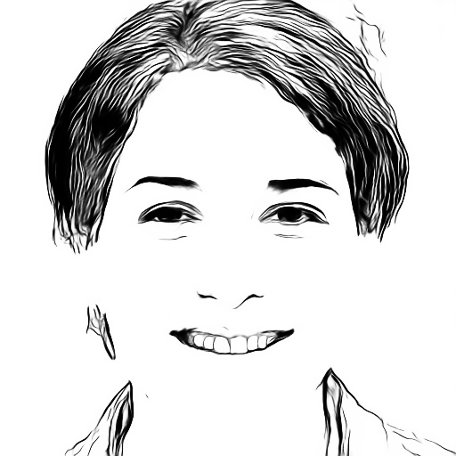

# **U2Net Portrait的推理部署**
## 效果展示



## 预训练推理模型下载
* 下载链接：[Paddle Quick Inference Examples](https://aistudio.baidu.com/aistudio/datasetdetail/66517)

## 代码示例
```python
# main.py
from pqi import InferenceModel
from processor import preprocess, postprocess

# 参数配置
configs = {
    'img_path': 'test.jpg',
    'save_dir': 'save_img',
    'model_name': 'u2net_portrait',
    'use_gpu': False,
    'use_mkldnn': False
}

# 第一步：数据预处理
input_data = preprocess(configs['img_path'])

# 第二步：加载模型
model = InferenceModel(
    modelpath=configs['model_name'], 
    use_gpu=configs['use_gpu'], 
    use_mkldnn=configs['use_mkldnn']
)
model.eval()

# 第三步：模型推理
d0, _, _, _, _, _, _ = model(input_data)

# 第四步：结果后处理
postprocess(
    d0, 
    configs['save_dir'],
    configs['model_name']
)
```
